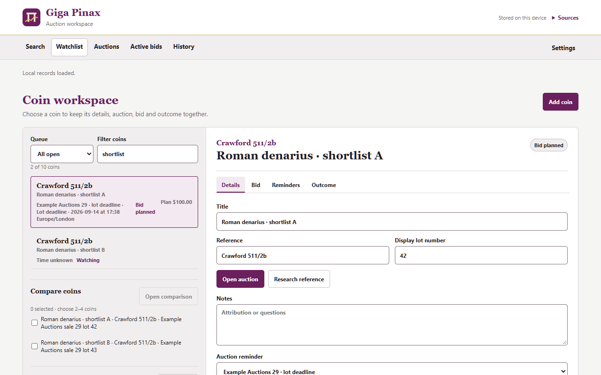

# Giga Pinax

[](https://github.com/bth0mp/Giga-Pinax/actions/workflows/ci.yml)

Giga Pinax is a Brave, Chrome and Firefox extension for researching ancient coin references and what they sell for. Type a catalogue reference or paste a whole lot description, and it resolves the type, fetches recent hammer prices — from acsearch using your own signed-in session, and from CoinArchives' public results using no session at all — works out what a bid really costs, and keeps the result in a local watchlist beside your own notes, photos and provenance. It has no account, no analytics and no server of its own, and it never places, changes or cancels a bid.



## What it does

- **Research** — resolve a reference from the type data bundled with the extension, or from American Numismatic Society and Nomisma services when the bundle cannot answer, or read every catalogue reference out of a pasted lot description or a right-clicked selection. An ambiguous reference offers choices instead of inventing an answer. Switch on **Show specimen photos** in Settings and a card for one type also shows up to three photographed museum coins of it, found through Nomisma.org.
- **Prices** — a median of recent acsearch sales, and a separately labelled median of CoinArchives public results. Each search looks for the reference as a phrase dealers actually write, counts how many results cite it (`39 of 55 results cite Price 23`) and keeps the rest out of the median; you can switch that filter off, narrow to one denomination, read a median per dealer grade (English, German, French, Italian, Spanish and Dutch grades are read, house spellings such as `GVF`, `Fdc`, `Stgl.` and `prfr.` included, and the Spanish `S/C` behind a weight or a closing remark, never behind a described reverse) and a median per year of the fetched sales, exclude a sale and watch the figures follow. Lots on the acsearch page that are not sold yet are listed as **Upcoming**, filtered the same way, each with a **Watch** button that opens it as a watchlist draft. Each panel shows its own query, sample and coverage. Currencies and providers are never pooled.
- **Capture the lot page you’re on** — capture the auction page you are looking at, read from its own structured data and metadata before its visible text, review the extracted reference and auction context, then research it or save an editable draft — with the estimate, closing time, photo link and provenance the page states offered for you to keep or clear.
- **Calculator** — hammer plus buyer premium, or the highest affordable hammer from a budget, including VAT on the premium, a live-bidding platform's fee on the hammer, import VAT or duty on hammer, premium and shipping for a coin crossing a border (Settings can start it at your usual rate for a sale in another currency), shipping, percentage and fixed payment fees, and either a fixed bid increment or the increment ladder you copied from a house's own terms.
- **Watchlist and workspace** — Closing soon, Needs outcome, Needs research, Planned, Active and Completed queues; auction identity with duplicate detection; measurements, condition, sourced provenance, external photo links, reminders and outcomes; comparison of two to four saved coins; and a collection history that totals what you recorded paying within each currency, never converted — each won coin's real cost (hammer, premium, VAT on the premium, import VAT and the fees saved with its bid) worked out and kept when its outcome is saved — from the bid, or from the premium and fees typed on the Outcome tab for a coin won without one — with hammer + premium shown where no fees were recorded and the total marked incomplete only where the hammer or premium rate is missing, and each entry's acquisition date, invoice paid and notes correctable in place, following a corrected outcome except where you corrected it yourself — beside the median of your own saved comparables for each coin's reference — your own evidence, not a valuation.
- **Local catalogue data** — 69,996 type records travel inside the package: 52,254 Roman Imperial (RIC) types with 2,808 replacement redirects, 2,602 Roman Republican (RRC) types, 4,573 Price types, 8,694 Seleucid Coins types, 1,691 Ptolemaic types of Lorber's CPE and 182 types of Newell's Demetrius Poliorcetes, with the English Nomisma.org name of every authority, denomination, mint, material and portrait they carry. A RIC, Crawford, Price, SC, CPE or Newell Demetrius reference the bundle holds is answered, and named, from data inside the package: no request to numismatics.org or nomisma.org, and the card appears with the network disabled. The price search that starts with every lookup still sends the search phrase to acsearch whenever acsearch access is granted. A reference the bundle does not hold, and every Bopearachchi reference, can still fall back to the online catalogue.
- **Backups** — records and settings export and import as JSON. An import can replace your records or merge into them: a merge keeps the version of each record that was written last and lists what it would change before anything is replaced, and a replace downloads a copy of your current records first. There is also a raw rescue export that works when nothing else will load, and a CSV export of lots, collection entries, bid history or outcome history for a spreadsheet, with each won coin's worked-out cost. Everything lives in your browser's extension storage; nothing is uploaded. Settings also keeps a list of the last 50 failures, without any search term, reference or record, for you to copy into a bug report.

## Catalogues

Type records resolve for RIC, RRC/Crawford, Seleucid Coins, Price, CPE (Lorber's *Coins of the Ptolemaic Empire*, `CPE 330`, `CPE B549`), Newell's *Demetrius Poliorcetes* (`Newell Demetrius 45`) and Bopearachchi, and a Svoronos number PCO links to the CPE type it became opens that type too. Many further catalogues are read for prices only, including RPC, Sear, SNG, BCD, HGC, Svoronos, a bare `Newell` number (Newell wrote several catalogues) and Krause KM#/Y# numbers; pasted lot text is read against a table of over 200 catalogue keys, so a dealer's citation is listed even when no open type data carries it.

```
RIC I² Nero 306        Crawford 44/5       SC 1266.2         Price 23
Bop Euthydemus I 24A   RPC I 1234          SG 6829           Netherlands KM# 123
```

## Install

Open the [Giga Pinax releases](https://github.com/bth0mp/Giga-Pinax/releases), choose the latest release, and download the ZIP for your browser under **Assets** — not GitHub's **Source code** archive. No GitHub account is needed, and you do not need Python.

- **Brave or Chrome:** extract the Brave ZIP, open `brave://extensions` or `chrome://extensions`, enable **Developer mode**, select **Load unpacked**, and choose the folder holding `manifest.json`.
- **Firefox 142+:** when the release carries a signed `giga-pinax-firefox-x.y.z.xpi`, select it in Firefox and confirm the installation; it stays installed and Firefox keeps it up to date. Otherwise open `about:debugging`, select **This Firefox**, choose **Load Temporary Add-on**, and select the unsigned Firefox ZIP. Firefox removes a temporary add-on when it restarts.

**Settings → Updates** shows the installed version and opens the latest package for your browser. Giga Pinax never polls GitHub or installs an update by itself; a signed Firefox install is updated by Firefox, from the project's update manifest. The [installation guide](docs/INSTALL.md) has the full steps, and the [changelog](CHANGELOG.md) has what each version changed.

## Privacy

Giga Pinax contacts a host only because you asked it to, and only these:

| Host | When |
| --- | --- |
| `numismatics.org`, `nomisma.org` | An online catalogue lookup, over HTTPS. A RIC, Crawford, Price, SC, CPE or Newell Demetrius reference answered by the bundled data contacts neither for its type record: the concept names a card shows are packaged with the records. Only **Show specimen photos**, when switched on, then asks `nomisma.org` for that type's photographed specimens. Bopearachchi references are always online. |
| `www.acsearch.info` | Every lookup, once acsearch access is granted: the price search starts with the lookup and uses your existing acsearch session. |
| `www.coinarchives.com` | Only after you select **Get CoinArchives prices** and grant optional access. One public results page, no credentials, no Pro data. |
| `github.com` | Only when you choose a release or update download. |
| `bth0mp.github.io`, `github.com` | Firefox only, and not from Giga Pinax: Firefox's own add-on update check may read the project's update manifest, as it does for every add-on that names one, and a signed install downloads a newer signed version from the GitHub release. |
| Your own photo hosts | Only once saved-coin comparison opens, for the external photo URLs you entered. |
| `nomisma.org` and museum image servers | Only with **Show specimen photos** switched on in Settings (it is off by default): one query to Nomisma.org for the type on a card, then up to six photos loaded, with no referrer, from the collections that hold the coins, which see your IP address. Nothing about them is kept. |

Links Giga Pinax offers but you open yourself — a CoinArchives Pro or acsearch search page, an RPC Online type page, an OCRE type page at the ANS, the auction page a saved coin came from — are ordinary browser navigations in a new tab, not requests the extension makes: they carry whatever that site already knows about your browser, and nothing from the extension beyond the search phrase in the link itself.

There is no account, no analytics and no developer-operated server; saved records never leave your browser unless you export them. Full details are in the [privacy policy](docs/PRIVACY.md).

## Development

The runtime has no dependencies, no bundler and no build step: plain ES modules the browser loads directly. From the repository root:

```sh
node --test tests/*.test.mjs
python -m unittest discover -s tests -p "test_*.py"
python scripts/build.py
npm ci --prefix tools/web-ext
tools/web-ext/node_modules/.bin/web-ext lint --source-dir dist/firefox --warnings-as-errors --self-hosted
npm ci --prefix tools/typescript
tools/typescript/node_modules/.bin/tsc -p jsconfig.json --noEmit
```

The popup, the workspace and the record store are each split by responsibility into modules beside them: `popup-*.js` holds the popup's fixed words, its host access requests, its frame (element lookup, scrolling, theme) and the panel pieces drawn from their arguments alone; `workspace-*.js` the workspace's views, its forms and its editors' bookkeeping; `store-*.js` the store's record builders, reminder reconciliation and quarantine restore; and in `core/`, `fields.js` holds the record bounds and field validators, `drafts.js` a draft's payload and `projections.js` the views' exposure and collection totals. `core/types.js` writes down, as JSDoc typedefs and nothing else, the shapes the store keeps. The files that start with `// @ts-check` (all of `core/`, the store and the modules above) are type-checked by the last command, which uses no build step and emits nothing; CI runs it on every pull request and every push to main. The page tests run each page with the modules it was split into in one sandbox (`tests/helpers/dom.mjs`, `PAGE_MODULES`).

`python scripts/build.py` copies an explicit allowlist into deterministic packages and writes every ZIP a release carries: unpacked `dist/brave/` and `dist/firefox/`, the versioned Brave, Chrome and Firefox ZIPs, and the stable `giga-pinax-brave.zip` and `giga-pinax-firefox.zip` aliases the update buttons resolve; the signed Firefox XPI and its `firefox-updates.json` come from the release workflow. The Chrome ZIP is a byte-identical copy of the Brave one. `python scripts/make_icons.py` reproduces the icon PNGs and needs Pillow; `web-ext`, pinned with its whole dependency tree in `tools/web-ext/`, validates the Firefox package and, in the release workflow, signs it; TypeScript, pinned with its lockfile in `tools/typescript/`, checks the types. Publishing is described in the [release guide](docs/RELEASING.md).

## Data attribution

The bundled type databases are derived from the American Numismatic Society's [OCRE](https://numismatics.org/ocre/), [CRRO](https://numismatics.org/crro/), [PELLA](https://numismatics.org/pella/), [SCO](https://numismatics.org/sco/), [PCO](https://numismatics.org/pco/) and [AGCO](https://numismatics.org/agco/) under the [Open Database License 1.0](https://opendatacommons.org/licenses/odbl/1-0/). The concept names a card shows — the authorities, denominations, mints, materials and portraits — and the RIC ruler suggestions, the ruler names and aliases the extension recognises and offers, are both derived from [Nomisma.org](https://nomisma.org/) concept data under [CC BY 3.0](https://creativecommons.org/licenses/by/3.0/). A short hand-written table adds the Latin, German, French, Italian and Spanish spellings dealers head a lot with ("Traianus", "Nerón", "Faustina Minor"); each names a person those Nomisma data already hold. The derived data keeps those licences. Coverage, provenance and the reproducible conversion are documented in [local catalogue data and attribution](docs/LOCAL-CATALOGUE.md).

## License

The code is released under the [MIT License](LICENSE). The bundled catalogue data keeps its own terms: OCRE, CRRO, PELLA, SCO, PCO and AGCO type data under ODbL 1.0 and Nomisma.org concept data under CC BY 3.0; see [local catalogue data and attribution](docs/LOCAL-CATALOGUE.md).
